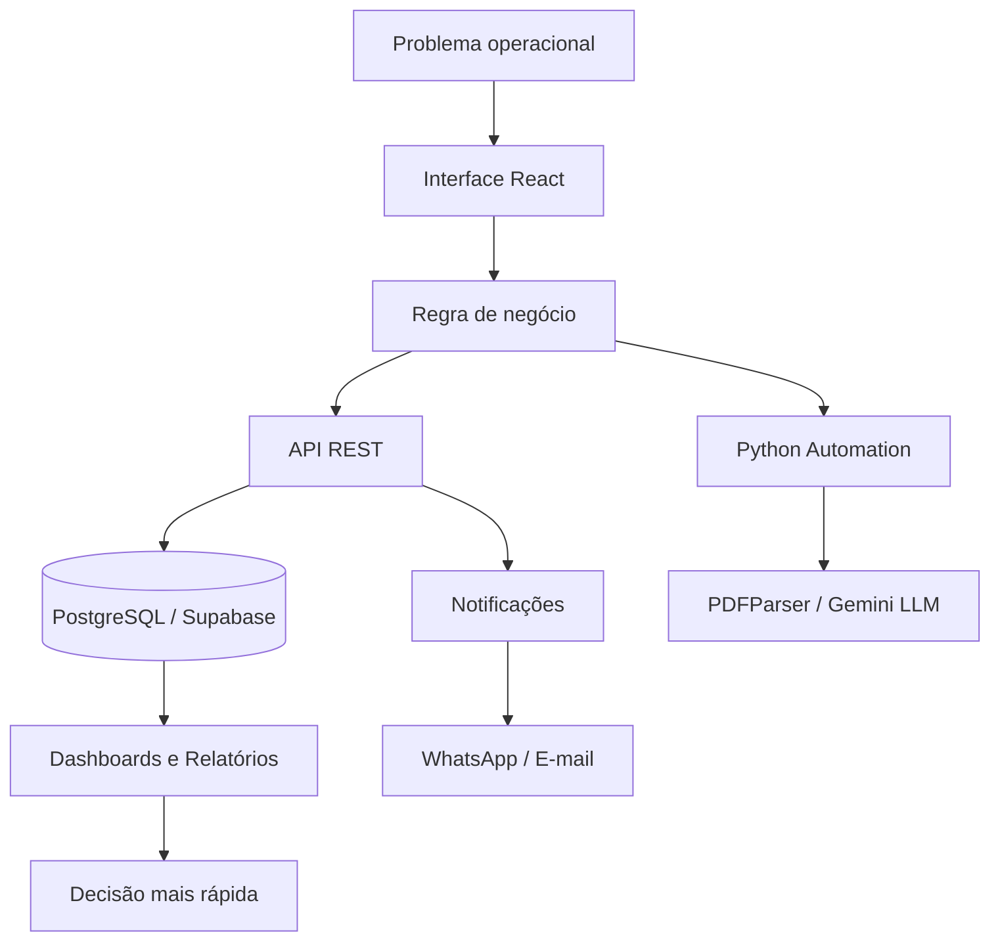

<div align="center">


<br />


</div>

<br />

<div align="center">


</div>

---

```txt
╭──────────────────────────────────────────────────────────────────────────────╮
│  ACCESS GRANTED                                                              │
│                                                                              │
│  user: Eduardo Melo                                                          │
│  role: Full Stack Developer                                                  │
│  mode: building internal systems, automations and operational tools           │
│  stack: React • Next.js • Node.js • Python • PostgreSQL • Supabase            │
│  mission: transform manual processes into useful, reliable software           │
╰──────────────────────────────────────────────────────────────────────────────╯
```

## 🧑‍💻 Sobre mim

Sou **Eduardo Melo**, desenvolvedor full stack focado em criar sistemas web, automações e ferramentas internas para resolver problemas reais de operação.

Meu trabalho conecta **interface, regra de negócio, banco de dados, APIs, relatórios, automações e integrações externas**. Gosto de construir sistemas que saem do campo da ideia e entram no uso prático: controle de jornada, dashboards, leitura automatizada de documentos, gestão interna, notificações e fluxos que reduzem trabalho manual.

Não desenvolvo apenas telas.  
Desenvolvo ferramentas para organizar processos, reduzir ruído operacional e transformar tarefas repetitivas em sistemas claros, seguros e eficientes.

---

## ⚙️ EduardoOS

```js
const EduardoMelo = {
  role: "Full Stack Developer",

  frontend: [
    "React",
    "Next.js",
    "Vite",
    "Tailwind CSS"
  ],

  backend: [
    "Node.js",
    "Python",
    "APIs REST"
  ],

  database: [
    "PostgreSQL",
    "Supabase"
  ],

  integrations: [
    "Evolution API",
    "Brevo",
    "EmailJS",
    "Gemini LLM",
    "PDFParser"
  ],

  interests: [
    "Sistemas internos",
    "Automações",
    "Dashboards",
    "Biometria facial",
    "Leitura de PDFs",
    "Relatórios",
    "Processos operacionais"
  ],

  principle:
    "software bom é aquele que resolve uma dor real antes de tentar parecer bonito"
}
```

---

## 🧭 Minha área de atuação

<table>
  <tr>
    <td width="50%">
      <h3>🧩 Sistemas internos</h3>
      <p>
        Desenvolvimento de plataformas para organizar demandas, processos,
        cadastros, fluxos administrativos, dashboards e relatórios.
      </p>
    </td>
    <td width="50%">
      <h3>⚡ Automações operacionais</h3>
      <p>
        Criação de soluções para reduzir tarefas manuais, processar documentos,
        calcular dados e padronizar rotinas repetitivas.
      </p>
    </td>
  </tr>
  <tr>
    <td width="50%">
      <h3>📊 Dados e relatórios</h3>
      <p>
        Estruturação de informações em bancos de dados, filtros, indicadores,
        painéis gerenciais e exportações para apoio à decisão.
      </p>
    </td>
    <td width="50%">
      <h3>🔌 Integrações</h3>
      <p>
        Conexão entre sistemas, APIs REST, WhatsApp, e-mail, Supabase,
        processamento com Python e serviços externos.
      </p>
    </td>
  </tr>
</table>

---

## 🧪 Projetos que representam meu trabalho

> Repositórios públicos serão preparados com versões demonstrativas, dados fictícios e sem informações sensíveis.

<table>
  <tr>
    <td width="50%">
      <h3>🟦 Ponto eletrônico com biometria facial</h3>
      <p>
        Sistema de registro de jornada com reconhecimento facial, cadastro
        biométrico, geolocalização, identificação de IP, espelho de ponto,
        relatórios e carga horária personalizada.
      </p>
      <p>
        <b>Stack:</b> React JS, Python, FaceAPI, MediaPipe, PostgreSQL,
        Supabase, Evolution API, Brevo, EmailJS
      </p>
    </td>
    <td width="50%">
      <h3>🟨 Sistema de gestão de chamados</h3>
      <p>
        Plataforma para abertura, acompanhamento e gestão de chamados internos,
        com painel Kanban, filtros, responsáveis, categorias e indicadores.
      </p>
      <p>
        <b>Stack:</b> React JS, Tailwind CSS, Node.js, PostgreSQL,
        Supabase, API REST
      </p>
    </td>
  </tr>

  <tr>
    <td width="50%">
      <h3>🟩 Sistema de gestão de férias</h3>
      <p>
        Controle de férias com solicitações, aprovações, calendário de ausências,
        regras por setor, conflitos e notificações automáticas.
      </p>
      <p>
        <b>Stack:</b> React, PostgreSQL, Python, Evolution API, Brevo
      </p>
    </td>
    <td width="50%">
      <h3>🟧 Calculadora de rescisões</h3>
      <p>
        Sistema para cálculo de verbas rescisórias, organização de dados
        contratuais, geração de recibos e conferência trabalhista.
      </p>
      <p>
        <b>Stack:</b> React, PostgreSQL, Python
      </p>
    </td>
  </tr>

  <tr>
    <td width="50%">
      <h3>🟪 Controle de ponto por PDF com IA</h3>
      <p>
        Importação de folha de ponto, leitura inteligente, separação por
        colaborador e cálculo de horas extras, faltas e totais.
      </p>
      <p>
        <b>Stack:</b> React, Gemini LLM, PDFParser
      </p>
    </td>
    <td width="50%">
      <h3>🟥 Sistema de adiantamento salarial</h3>
      <p>
        Leitura de folha salarial em PDF, extração de salário bruto, descontos
        e cálculo automático de adiantamento de 40%.
      </p>
      <p>
        <b>Stack:</b> React, Gemini LLM, PDFParser, Python
      </p>
    </td>
  </tr>
</table>

---

## 🧬 Stack DNA

<div align="center">


</div>

<br />

```txt
Frontend        React • Next.js • Tailwind CSS • Vite
Backend         Node.js • Python • APIs REST
Database        PostgreSQL • Supabase
Automation      Python • PDFParser • Gemini LLM
Integrations    Evolution API • Brevo • EmailJS
UI              Dark interfaces • Dashboards • Admin panels
```

---

## 🗺️ Architecture Map



---

## 🧠 Como eu penso software

```txt
1. Entender a rotina real
2. Mapear onde existe retrabalho
3. Separar regra de negócio de interface
4. Criar um fluxo simples para o usuário
5. Automatizar o que não precisa ser manual
6. Registrar dados de forma organizada
7. Gerar relatórios úteis
8. Melhorar continuamente
```

---

## 📊 GitHub Analytics

<div align="center">


</div>

<br />

<div align="center">


</div>

---

## 🛰️ Current Signal

```txt
status        disponível para oportunidades e projetos
location      Petrolina, Pernambuco - Brasil
focus         sistemas internos, automações, dashboards e APIs
learning      sempre refinando arquitetura, UI e automação com Python
```

---

## 📬 Contato profissional

<div align="center">

<a href="https://www.linkedin.com/in/edumeloo" target="_blank">
  
</a>

<a href="mailto:eduardomelo0704@gmail.com">
  
</a>

<a href="https://wa.me/5587981115127" target="_blank">
  
</a>

<a href="https://github.com/eduardomelomg" target="_blank">
  
</a>

</div>

---

<div align="center">

```txt
╭──────────────────────────────────────────────────────────────╮
│  building systems that replace manual work with clarity       │
│  connecting interfaces, data, automation and real operations   │
╰──────────────────────────────────────────────────────────────╯
```


</div>
